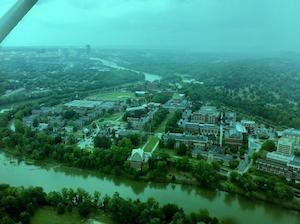
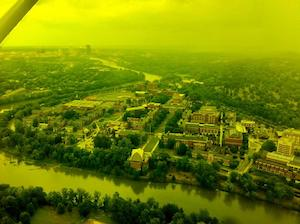
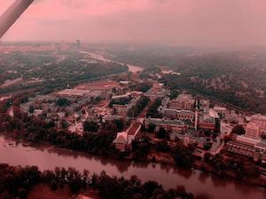
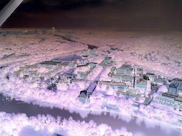
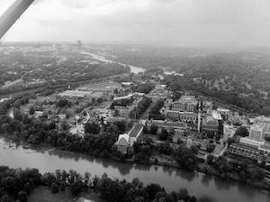

# Assignment 2: Image Processor

Due: Thursday, September 26, 2019

This assignment tests your ability to write a program that uses **hierarchial decomposition** (as described in the book in section 4.4.1, page 99).  Instead of writing a program with one function, you'll take several functions and have them work together torwards one goal.

**The goal:** write a program that takes one digital image and makes several copies; each copy will be a variation of the original.

## Instructions

- [ ] Create a new python file named **assignment02.py**

### Part 1: Copy Programs from the Book

- [ ] In the assignment02.py file, replicate the following six sample programs from the book (you can type them as-is or make your own modifications based on your own style preferences)
  - **Program 34: Reduce the Amount of Red in a Picture by 50%**
  - **Program 35: Increase the Red Component by 20%**
  - **Program 36: Clear the Blue Component from a Picture**
  - **Program 37: Making a Sunset**
  - **Program 41: Create the Negative of the Original Picture**
  - **Program 42: Convert to Grayscale**

- [ ] Each of the six programs need to have its own **comment header** that shows the program number and name as shown in the book. For example:

  ```python
  # *********************
  # Program 34: Reduce the Amount of Red in a Picture by 50%
  # *********************
  ```
  

### Write a Program that Runs All the Other Programs

Then write one another program - a single function - in the assignment02.py file (not shown in the book) that fulfills the following requirements:

- [ ] Create a comment header that says, `Assignment 2: Image Processor`
- [ ] Create a function named `imageProcessor()`
- [ ] Have the Image Processor function accept one parameter that will be a file name (it will be a String, actually) - you create the parameter name; make sure the name is appropriate for what it's doing

Then, in the Image Processor function do the following THREE steps for *each* of the six programs:

- [ ] Take the variable passed-in from the function's parameter (the String that will represent a filename) and use the `makePicture()` function to create a picture object out of it.  Store that picture object in a variable (you create an appropraite variable name)
- [ ] Then use that picture object you just created to call one of the functions from the book (start with the first one, Program 34), example: `decreaseRed(picture)`
- [ ] Then use the `writePictureTo()` function (described in section 4.2, page 83) to write a new digital picture file with a filename that describes the image, example:<br>`writePictureTo(picture, "decreaseRed.jpg")`

Then, continuing on in the Image Processor function, under those three lines, do those three steps (above) again and again for the other five programs.

*NOTE: some of you might think you only need to run the `makePicture()` function once and then reuse the object that comes out of it over and over for each program.  That won't work right!  If you do it that way each program will alter the same picture object and make a mess of it by the end.  You need to create a new picture object for each program!*

Finally, write a TEST block as follows

- [ ] Create a comment block for the TEST block
- [ ] Start the test block with the `setMediaPath()` command
- [ ] Then, hard code the name of YOUR digital image that you're using with this assignment and save the file name in an appropriately named variable
  - For this assignment, use the same, reduced file you used with your In-class Lab 4 from last Thursday

- [ ] Then, use that variable that's holding your digital image's file name and use it as the argument to call the `imageProcessor()`

## Check Your Handiwork

If you followed the instructions above correctly, the result will generate six new files that look like this:

My original:


The six new image files:
     


### Turn-in the Assignment for Credit

1. When your program is working correctly, open a web browser and navigate to our DMS 102 section in Blackboard; in the "Labs and Assignments Turn-in" area find **Assignment 2: Image Processor**
2. Upload (attach) your **assignment02.py** file and *all seven image files* (the original plus the six generated files), and then click the Submit button
   - Please do not ZIP the files together.  You can attach all the files separately in the Blackboard submission.  (Leaving them separate makes it easier for me to grade!  Thanks.)
